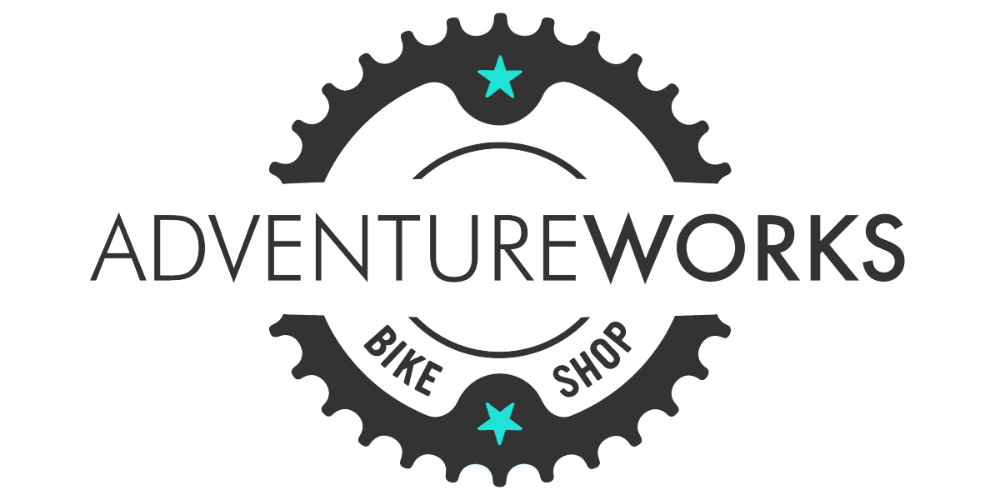
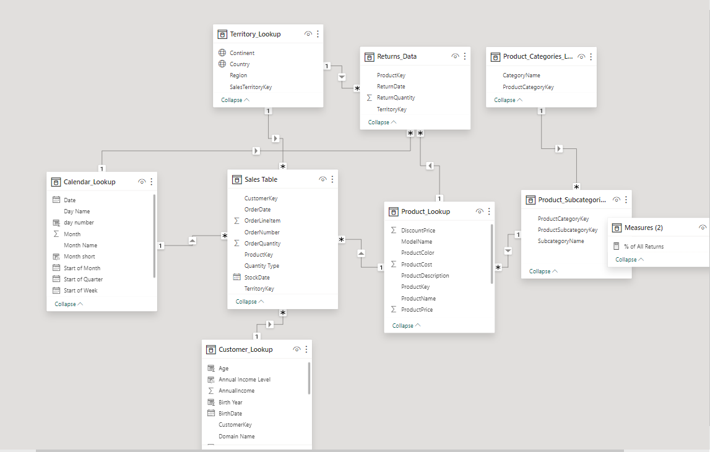
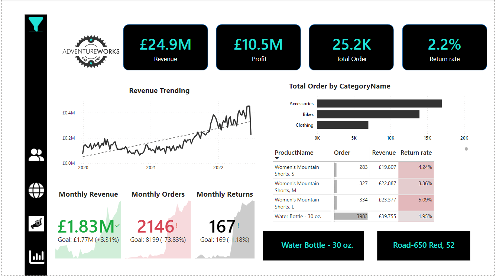
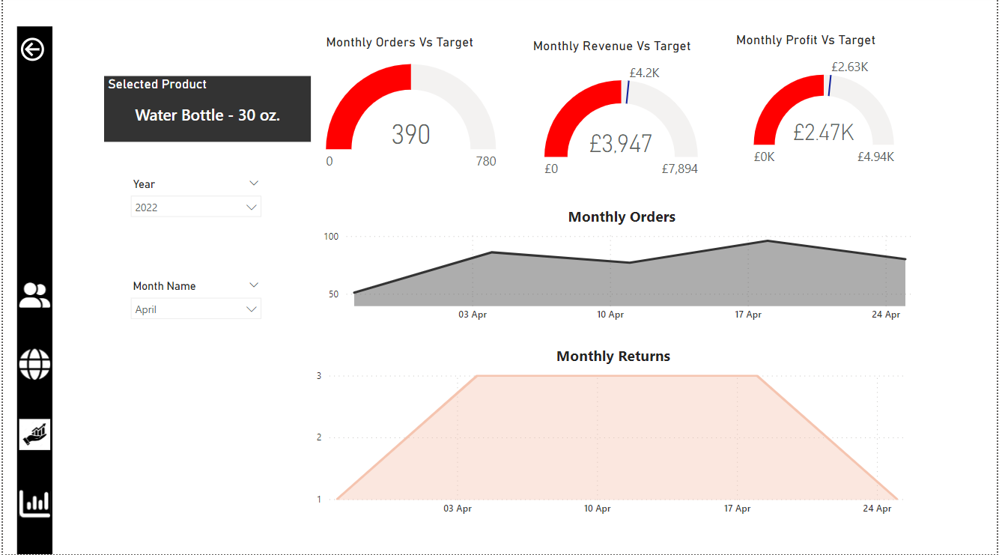
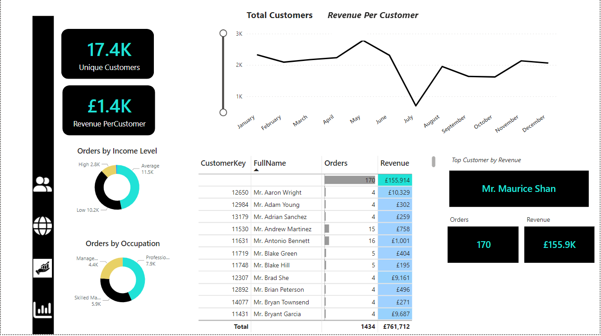

# Adventure-work
Sales Trend from 2019- 2022

***
## Introduction
Sales is the end of the marketing funnel that converts the prospects into actual customers. Sales fill the gap between the customers and the company through product that can fulfil their needs.
Sales trend is a methodology to understand sales results which helps in understanding the trends of the market over a specific period. 
This is a Powerbi project on sales trending from 2019-2021. The project aimed at providing valuable insight on the sales trending across all products so as to help the management to manage the analysis of sales across all boards.

The report is in 4 pages, which includes;

1.	Executive page

2.	Map page

3.	Productive details page

4.	Customer details page

## Problem Statement

For a manufacturing firm to meet customer needs,  resources must be utilize efficiently and increase profitability, efficient production performance is essential. The project give answers to the following questions:
- What is the Total cost?
- What is the Total customer?
-	What is the Total order?
-	What is the Total profit?
-	What is the Total returns?
- What is the Total revenue?
- What is the Return rate?
-	What is the Order target?
-	What is the Quantity return?
-	What is the Quantity sold?
-	What are the top Total order by product name?

## Skills Demonstrated

The following power bi features were used in the course of the report:

-	Data Analysis Expression (DAX)
-	Card visuals
-	Page navigation
-	Filter
-	Line chart
-	Doughnut chart
-	Tables

## Data Sourcing

The data was produced by Adventure work by Datakliq

## Data Modelling

A snowflakes model was used connecting all the fact and dimension I utilized the import storage mode to bring in my data into Power BI, the data was transformed then relationships was established.  Majority of these relationships have a one-to-many cardinality, and a single filter direction was applied.

## Analysis and visualization
  
1.	A unique Customer of 17.4 thousand, Revenue per customer was 1.4 thousand.
2.	A Total revenue of 24.9 million, Total order of 25.2 thousand, Profit of 10.5 million and Return rate of 2.2% was made.
3.	There was an increment in the Revenue trending from 2020, 2021 to 2022.
4.	Accessories has the highest Order by category name followed by Bikes then clothing has the least.
5.	North America has the highest revenue of 9,708,245, Europe has a Revenue of 7,789,885 and Pacific has 7,416,456 Revenue.
6.	Professionals has the highest Order of 7.9 thousand, Skilled manual has Order of 5.9 thousand and Management has Order of 4.4 thousand.

## Conclusion

There is strong financial performance, stable return rate, and healthy profit margins which depicts effective operations.

## Recommendation

There should be continued focus on customer experience, enhancement, and market expansion opportunities to sustain growth and mitigate potential risks. By addressing these areas and maintaining a proactive approach to risk management, this can help in sustaining success and drive continued growth in the future.

**_To interract with the report, click [Here](https://app.powerbi.com/view?r=eyJrIjoiMDA4YjE3MzItMDMyNi00NTYzLWFlMzUtM2E0NTM0Njg4YmY5IiwidCI6ImZiNjI0Y2ZkLWQzYjEtNGIwYi05NmQxLThkMzg3ZWQxYmMyZSIsImMiOjh9)_**

**Thanks for reading 🙇**
